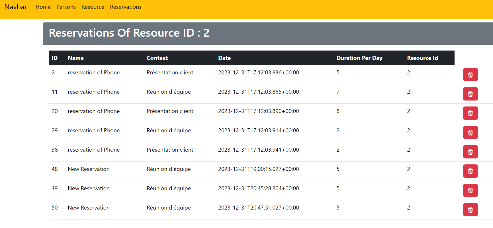

<H5  style="text-align:center"> We want to create an application based on a microservice
architecture that can manage reservations resources. Each reservation concerns a single resource.</H5>
<H3>- All Resources</H3>

<H3>- Login </H3>

<H3>- User2 Was Logged Successfully</H3>

<H3>- All Persons</H3>

<H3>- Add New Person</H3>

<H3>- Person Was Added Successfully</H3>

<H3>- Reservation Of A Person</H3>

<H3>- Add New Reservation</H3>

<H3>- Reservation Was Added Successfully</H3>

<H3>- Get Reservations By Resource</H3>

